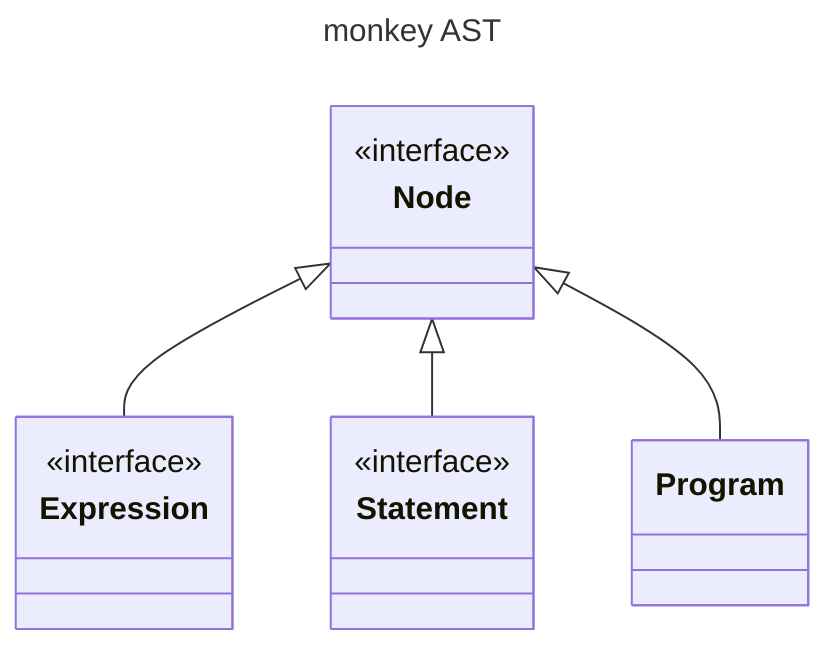
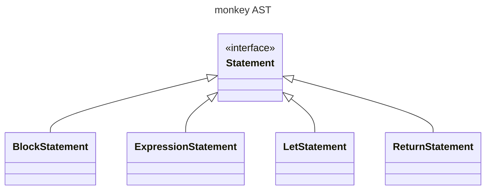
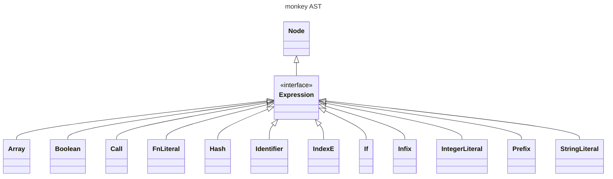
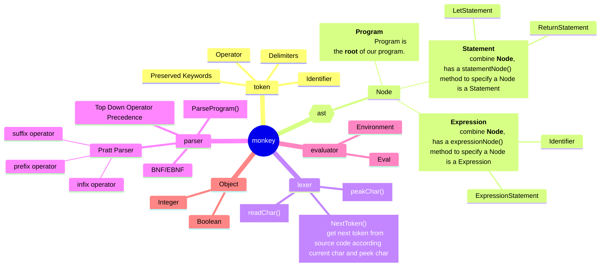
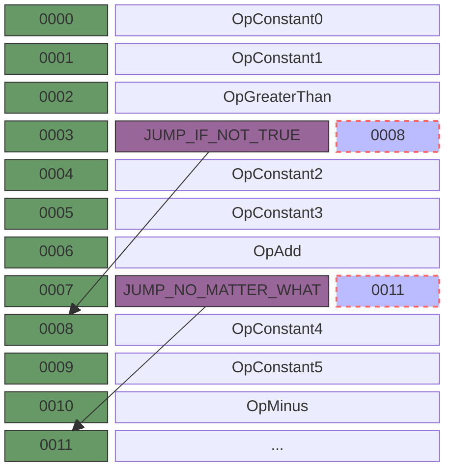
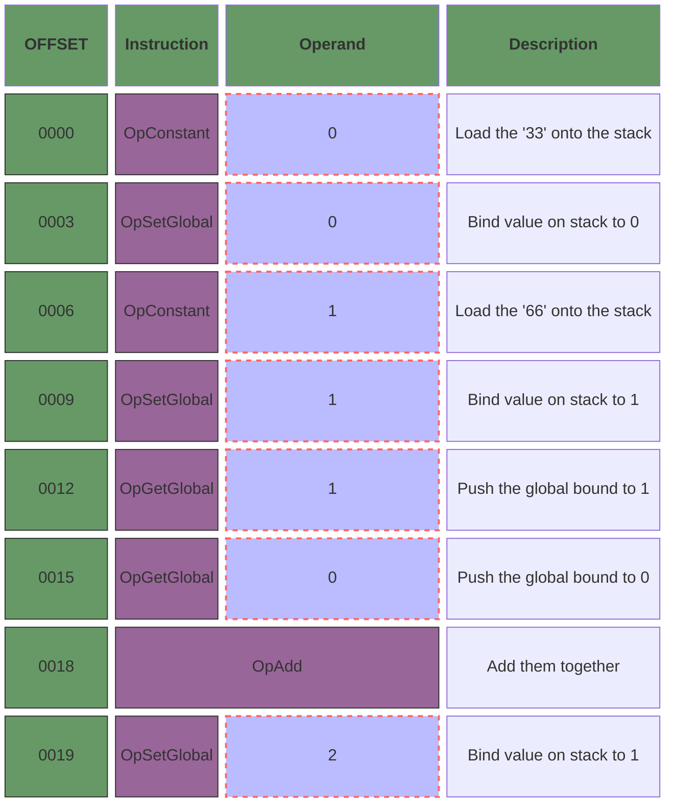
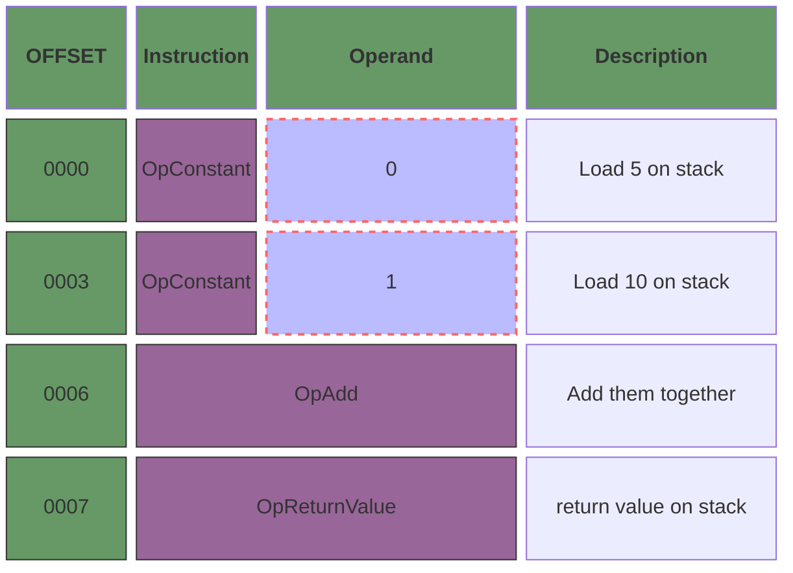

# monkey

## acknowledge

This is an experimental project under the guidance of [Writing An Interpreter In Go](https://interpreterbook.com/) and [Writing A Compiler In Go](https://compilerbook.com/).

In this repository, I am going to build my own `lexer`,  `parser`, `AST` , `evaluator`, `compiler`, `Intermediate Representation`, `Virtual Machine` .

Pay my utmost tribute to the author [Thorsten Ball](https://thorstenball.com/), an extraordinarily excellent project you have created!

## install

```bash
go work init interpreter compiler

go work sync
```

## summary

the language is called `Monkey` and has the following features：

- `C-like` syntax
- variable bindings
- integers and boolean
- arithmetic expressions
- built-in functions
- first-class and higher-order functions
- closures
- a string data structure
- an array data structure
- a hash data structure

## usage

### primary type, hash and array

```js
// here is how we bind values to names in Monkey
let age = 1;
let name = "Monkey";
let result = 10 * (20 / 2);

// array
let myArray = [1, 2, 3, 4, 5];

// hash
let thorsten = {"name": "Thorsten", "age": 28};

// accessing the elements in arrays and hashes is done with index expression
let intValue = myArray[0];
let name = thorsten["name"];
```

### function

```js
// the let statements can also be used to bind functions to names
let add = fn(a, b) {
  return a + b;
};

// implicit return values are also possible
let add_ = fn(a, b) {
  a + b
};
```

### recursive

```js
// a more complex function
let fibonacci = fn(x) {
  if (x == 0) {
    return 0;
  };
  if (x == 1) {
    return 1;
  };
  return fibonacci(x - 1) + fibonacci(x - 2);
};

fibonacci(10);
```

### closure

#### a simple closure with first-class function

```js
let returnsOne = fn() { 1; };
let returnsOneReturner = fn() { returnsOne; };

let closure = returnsOneReturner();
closure()
```

#### a more complex closure

```javascript
// a special type of functions, called higher order functions
let twice = fn(f, x) {
  return f(f(x));
};

let addTwo = fn(x) {
  return x + 2;
};

twice(addTwo, 2);
```

### local bindings

```js
let globalSeed = 50;

let minusOne = fn() {
  let num = 1;
  globalSeed - num;
};

let minusTwo = fn() {
  let num = 2;
  globalSeed - num;
};

// 97
minusOne() + minusTwo();
```

## module

the interpreter will have a few major parts:

- the lexer
- the parser
- the Abstract Syntax Tree(AST)
- the internal object system
- the evaluator
- the compiler
- the virtual machine

## structure

### Node



### Statement



### Expression



## Recursive descent

According to structure, the `recursive descent` should be like the following code :

```go
func (c *Compiler) Compile(root ast.Node) error {
	switch node := root.(type) {
	case *ast.Program:
		return c.compileProgram(node)
	case ast.Expression:
		return c.compileExpression(node)
	// TODO support more ast
	case ast.Statement:
		return c.compileStatement(node)
	}
	return nil
}

func (c *Compiler) compileProgram(program *ast.Program) error {
	for _, stmt := range program.Statements {
		err := c.Compile(stmt)
		if err != nil {
			return err
		}
	}
	return nil
}

func (c *Compiler) compileExpression(expr ast.Expression) error {
	switch expr := expr.(type) {
	case *ast.IntegerLiteral:
		return c.compileIntegerLiteral(expr)
		// TODO support more expression type
	case *ast.InfixExpression:
		return c.compileInfixOperator(expr)
	}
	return common.NewErrUnsupportedCompilingNode(expr.String())
}

func (c *Compiler) compileStatement(statement ast.Statement) error {
	switch stmt := statement.(type) {
	case *ast.ExpressionStatement:
		return c.compileExpressionStatement(stmt)
		// TODO support more statement type
	}

	return common.NewErrUnsupportedCompilingNode(statement.String())
}
```

## interpreter



## compiler

### Jumps

```js
if (0 > 1) {
  2 + 3
} else {
  4 - 5
}
```



### global identifiers

```js
let x = 33;
let y = 66;

let z = x + y;
```



The compiler is responsible for mapping identifiers to indices on the stack. And in the VM we'll use a slice to implement the creation and retrieval of global bindings.We'll call this slice our "global store" and we'll use the operands of the `OpSetGlobal` and `OpGetGlobal` instructions as indexes into it.

### functions

consider the follwing code snippet: A function without arguments, an integer arithmetic expression in the body, and a *explicit return statement*.

```js
fn() {
  return 5 + 10;
}
```



### frames

Consider this:

```js
// define
let one = fn() { 5; };
let two = fn() { one(); };
let three = fn() { two(); };

// call
three();
```

As we know, function calls are nested and execution-relevant data(the instructions and the instruction pointer) is accessed in a last-in-first-out manner. The solution is to tie them together and call the resulting bundle a `frame` -- short for `call frame` or `stack frame`.

On real mechines, a frame is not something separate from but a designated part of the stack.**It's where the return address, the arguments to the current function and its local variables are stored.**

```go
package vm

import "0x822a5b87/monkey/compiler/code"

// Frame short for call frame or stack frame
// A Frame has two fields: ip and fn.
// fn points to the compiled function referenced by the frame.
// ip is the instruction pointer in this frame, for the function.
type Frame struct {
	fn *code.CompiledFunction
	ip int
}

func NewFrame(f *code.CompiledFunction) *Frame {
	return &Frame{
		fn: f,
		ip: -1,
	}
}

func (f *Frame) Instructions() code.Instructions {
	return f.fn.Instructions
}

```


