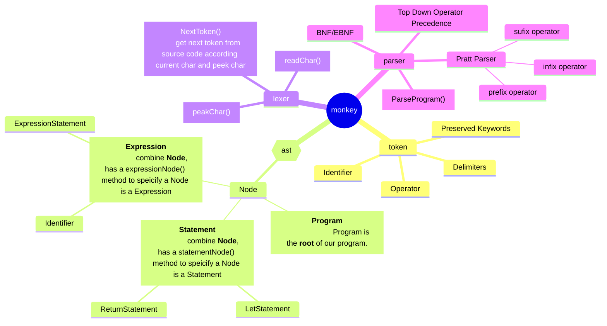

# monkey

> **writing an interpreter/compiler in Go**
>
> In this repository, I am going to build my own lexer, my own parser, my own tree representation and my own evaluator.

## install

```bash
go work init interpreter/

go work sync
```

## summary

the language is called `Monkey` and has the following features：

- `C-like` syntax
- variable bindings
- integers and boolean
- arithmetic expressions
- built-in functions
- first-class and higher-order functions
- closures
- a string data structure
- an array data structure
- a hash data structure

```javascript
// here is how we bind values to names in Monkey
let age = 1;
let name = "Monkey";
let result = 10 * (20 / 2);

// array
let myArray = [1, 2, 3, 4, ,5];

// hash
let thorsten = {"name": "Thorsten", "age": 28};

// accessing the elements in arrays and hashes is done with index expression
let intValue = myArray[0]
let name = thorsten["name"]

// the let statements can also be used to bind functions to names
let add = fn(a, b) {
  return a + b;
};

// implicit return values are also possible
let add2 = fn(a, b) {
  a + b;
};

// a more complex function
let fibonacci = fn(x) {
  if (x == 0) {
    return 0
  }

  if (x == 1) {
    return 1
  }

  return fibonacci(x - 1) + fibonacci(x - 2);
};

// a special type of functions, called higher order functions
let twice = fn(f, x) {
  return f(f(x));
}

let addTwo = fn(x) {
  return x + 2;
}

twice(addTwo, 2);
```

## module

the interpreter will have a few major parts:

- the lexer
- the parser
- the Abstract Syntax Tree(AST)
- the internal object system
- the evaluator

## interpreter



