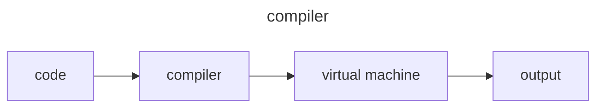
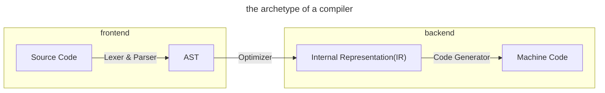
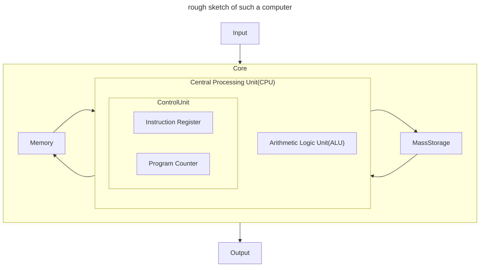

# Compilers & Virtual Machines



## Compilers

> Here is [Wikipedia's version](https://en.wikipedia.org/wiki/Compiler)
>
> A compiler is a computer software that transforms computer code written in one programming language(the source language) into another computer language(the target language).Compilers are a type of translator that support digital devices, primarily computers.**The name compiler is primarily used for programs that translate source code from a high-level programming language to a lower level language(e.g. assembly language, object code, or machine code) to create an executable program.**

The variety between compilers is so high that we can't make a lot of universal statements about their architecture.That being said, we can ignore the details for a minute now and sketch out the architecture of something like the archetype of a compiler:



1. The lexer and parser is called the frontend.The source code is turned from text into an AST.
2. the "optimizer"(or sometimes also called "compiler") might translate the AST into another internal representation.This additional IR might just another AST, or maybe a binary format, or even a textual format.**The major reason for why we need IR is the IR might lend itself better to optimizations and translation into the target language than AST would.**This new IR then goes through an optimization phase: dead code is eliminated, simple arithmetic is pre-calculated, code that doesn't need to be in the body of a loop is moved out of it, ... A ton of possible optimizations exists.
3. Finally, the code generator, also called the backend,generates the code in the target language.

## Virtual and Real Machines

What we are going to talk about(and later build) are virtual machines that are used to implement programming languages.Sometimes they consist of just a few functions, other times they make up a few modules and on occasion they are a collection of classes and objects.

What's important is this : **they don't emulate an existing machine. The `are` a machine.**The `virtual` is due to the fact they only exist in software, not in hardware, and are thus purely abstract constructs.

### Real Machines

Nearly every computer is built according to the [von Neumann architecture](https://en.wikipedia.org/wiki/Von_Neumann_architecture), which an arithmetic logic unit(ALU) and multiple processor registers, and a control unit with an instruction register and a program counter.Together they're called the central processing unit, often shortened to CPU.Besides that, the computer also contains memory(RAM),mass storage(think: hard drive) and input/output devices(keyboard and display).



As soon as the computer is turned on, the CPU:

1. Fetches an instruction from memory.The Program Counter tells the CPU where in memory it can find the next instruction.
2. Decodes the instruction. To identify which operation should be executed.
3. Executes the instruction.This can mean either modifying the contents of its registers, or transferring data from the registers to memory, or moving data around in memory, or generating output, or reading input...
4. `GOTO` <1> again.

the pseudocode is like this:

```go
for {
  instruction := ProgramCounter.FetchInstruction(memory)
  operation := ControlUnit.DecodeInstruction(instruction)
  ALU.execute(operation)
}
```

These three steps are called **fetch-decode-execute** cycle, or instruction cycle.

We start out investigation with this question: how does CPU address different parts of memory?Or, in other words:how does CPU know where to store and retrieve things that are located in memory?

We're given a first hint by how the CPU fetches instructions.**The Program Counter**, a part of the CPU, keeps track of where to fetch the next instruction. The computer simply uses numbers to address different parts of memory.Yes, numbers.

Just think of memory as a huge array, the CPU uses numbers as address when accessing data in memory.

Instead of "array elements" computer memory is segmented into "words".Now what's a "word"?It's the smallest addressable region of memory.It's the base unit when accessing memory.


