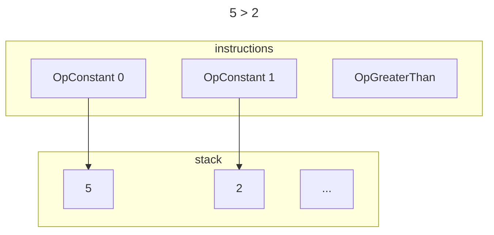
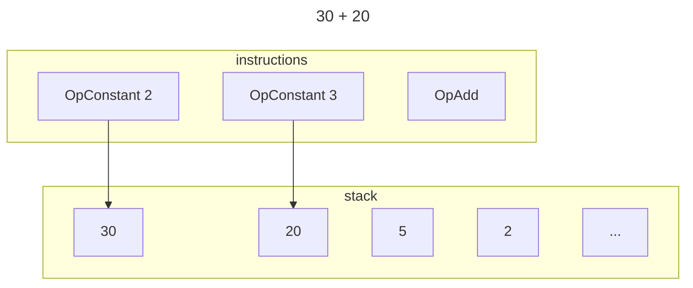
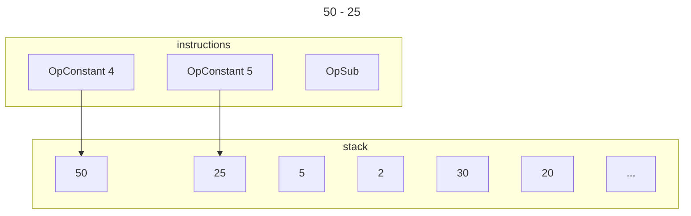
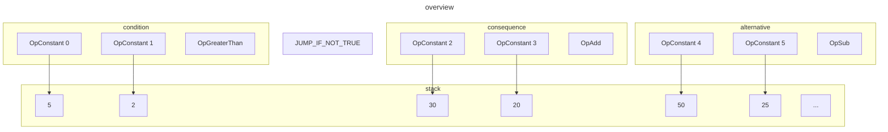
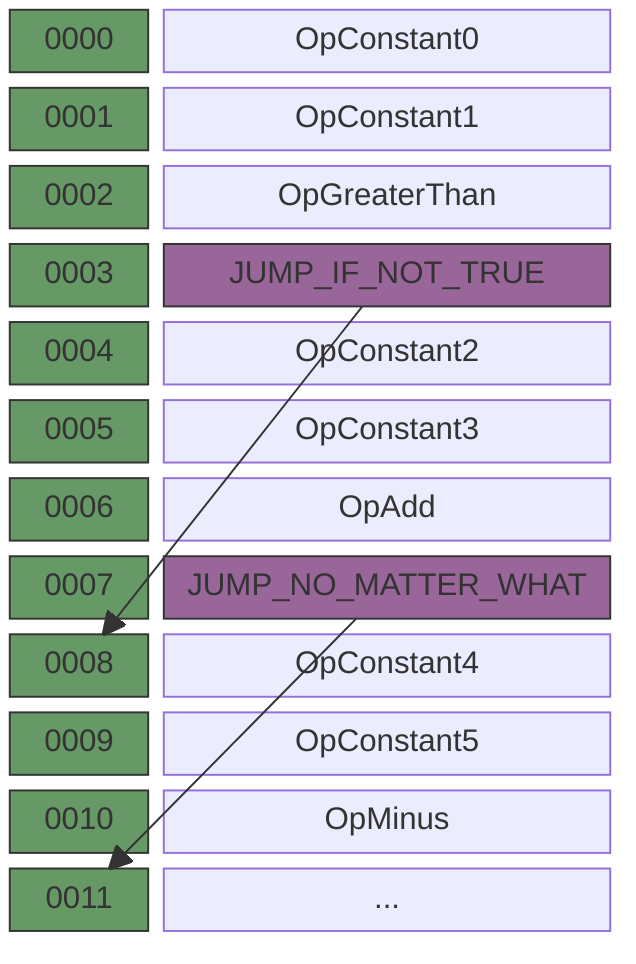
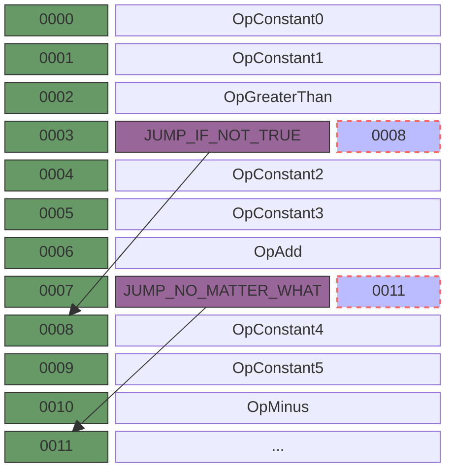

# Conditionals

Let's say we have the following monkey code:

```javascript
if (5 > 2) {
  30 + 20
} else {
  50 - 25
}
```

> represent the condition `5 > 2` 



> represent the consequence `30 + 20`



> represent the alternative `50 -25`



> represent the whole code snippet



If we were to take these instructions and pass them to the VM as a flat sequence, what would happen?The VM would execute all of them, one after the other, happily incrementing its instruction pointer, fetching, decoding and executing.And that's exactly what we don't want!

we need put something in the blanks so that based on the result of the `OpGreaterThan` instrction the VM either ignores the instrcutions of the consequence or the instructions making up the alternative. It should skip them. Or instead of `skip`, should we maybe say `jump over`?

### Jumps

`Jumps` are instructions that tell machines to jump to other instructions, or we can say: **jumps are instructions that tell the VM to change its instruction pointer to a certain value.**



we use numbers to tell the VM where to jump to, and it can be seperated to different type: `absolute offset` and `relative offset`.

- absolute offset : the jump target being the index of an jump instruction
- relative offset : relative to the position of the jump instruction itself and denote not where exactly to jump to, but how far to jump.

If we represent the code with offsets and give each instruction a unique index that's indpendent of its byte size(for inllustration purposes), the diagram looks like this:




