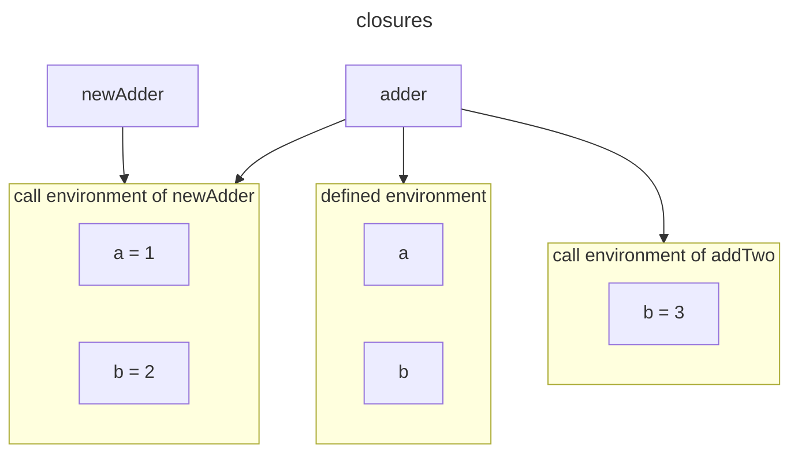

# Closures

Here's a prime example:

```js
let newAdder = fn(a) {
	let adder = fn(b) { a + b; };
	return adder;
};
let addTwo = newAdder(2);
addTwo(3); // => 5
```

### Implementation in interpreter

A little recap hepls to set the stage, so here's a tough sketch of our path to closures in *Writing a interpreter in Go*:

1. add an `Env` field to `object.Function` to hold an `*object.Environemnt`, which is what we used to store global and local bindings.
2. when we evaluated an `*ast.FunctionLiteral`, which turns it into an `*object.Function`, we put a pointer to the current environment in the `Env` field of the new function.
3. When the function was called, we evaluated its body in this environment, the one we put in the `Env` field. **The practical effect of all this was that functions always had access to the bindings of the environment in which they are defined, even mush later and in any place.**

The reason I wanted to go over the old implementation again is because of how closely it maps to the way we think about closures: they're functions that "close over" their environment at the time of their definition, wrap around it and carry it with them, just like the pointer to the `*objet.Environment` in the `Env` field.

More specifically, there are two distinct environments associated with a function

1. call environment : the environment when the function is called;
2. function define environment : the environment when the function is defined.

when a function is called, there should have an environment chain:

>inside function env -> args -> call env -> ...

and a function call contains its own environment and this environment is initiated when a FnLiteral is evaluated which is the fn.Env
the fn.Env contains environment: call env -> ...
so what we should do is initiate the args, and use fn.Env as its parent env.

> `FnLiteral` and `Fn`

```go
type FnLiteral struct {
	Token      token.Token
	Parameters []*Identifier
	Body       *BlockStatement
}

type Fn struct {
	Params []*ast.Identifier
	Body   *ast.BlockStatement
	Env    *Environment
}
```

Here is another example and illustration:

```js
let newAdder = fn(a, b) {
	let adder = fn(b) { a + b; };
	return adder;
};
let addTwo = newAdder(1, 2);
addTwo(3);
// 4
```

There are two function called newAdder and adder, and the adder is a closure, its environment would be like this:



which means, adder containts two variables:

1. the call of function `newAdder(2)` set `a = 1` and `b = 2`;
2. the call of function `addTwo(3)` set `b = 3`;

the call environment of itself override the variable in newAdder.

### Implementation in Compiler

Let's try to make this more tangible by mentally following the snippet from above as it moves through our current implementation.

1. Compilation:
   1. we compile both functions -- `newAdder` and `addTwo` -- are turned into a series of instructions and added to constant pool.
   2. we emit `OpConstant` instructions to instruct the VM to load the functions on the stack.
2. Execution:
   1. the value is known as soon as we execute `newAdder`. By that time, though, `adder` has already been compiled and its instructions will simply be loaed on to the stack, contained in an `*object.CompiledFunction`, and returned from `newAdder` -- without any chance to "close over".

> You can see where the challenge lies. In the Vm, we need to get the value of `a` into an already-compilied adder function before it's returned from newAdder, and we need to do it in such a way that an adder later on can access it.

### [free variable](https://en.wikipedia.org/wiki/Free_variables_and_bound_variables)

Take another look at this part of the code snippet:

```js
let newAdder = fn(a) {
  let adder = fn(b) { a + b; };
  return adder;
};
```

From adder's point of view `a` is a *free variable*.I have to admit that this was never an intuitive name to me, but free variable are those **which are neither defined in the current local scope nor are they parameters of the current function.** Since they are not bound to the current scope, they are free.

Implementing closures with a compiler and a VM revolves aroud free variables.

Here's how we're going to pull this off: **we're going to turn every function into a closure.**

> Let's translate this into practical terms. First, we'll define a new object in our object package, called **Closure**. It will have a pointer to an ***object.CompiledFunction** and a place to store the free variables it references and carries around.
>
> The compilation of functions itself, though, won't change.
>
> **But while compiling the function's body we'll inspect each symbol we resolve to find out whether it's a refence to a free variable.** If it is, we won't emit an OpGetLocal or a OpGetGlobal instruction, but instead a new opcode that loads the value from the "store for the free variables" part of the object.Closure.We'll have extend our SymbolTable so it can take care of this part for us.
>
> After the function's body is compiled and we exit its scope in the compiler, we proceed to check whether it references any free variables. Our upgraded SymbolTable will provide information on the number of referenced free variables and the scope in which they were originally defined. This scope attribute is crucial because the next step involves transferring these free variables to the compiled function during runtime. To accomplish this, we emit instructions that place the referenced free variables onto the stack. To determine which instructions to emit, we rely on knowing the scope in which the bindings were created. Without this information, we would not know how to proceed with emitting the instructions accurately.
>
> **In summary: detect references to free variables while compiling a function, get the referenced values on to the stack, merge the values and the compiled function into a closure and leave it on the stack where it can then be called. Let’s go.**


