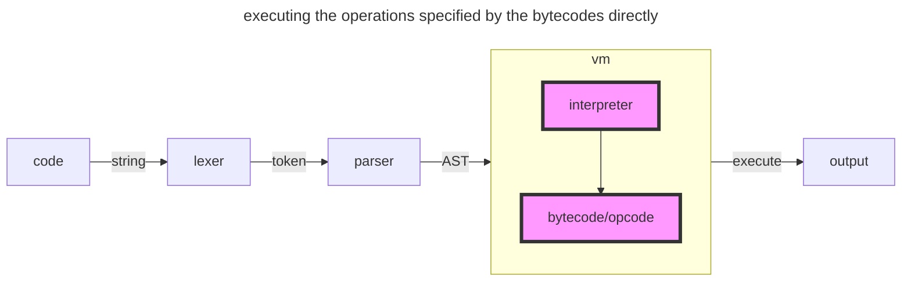
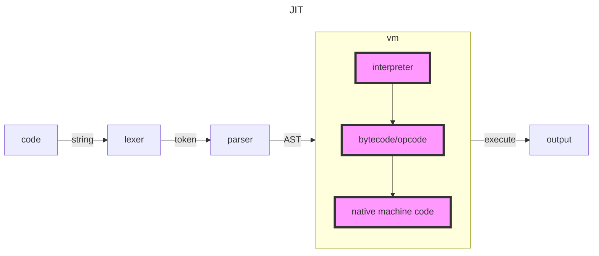
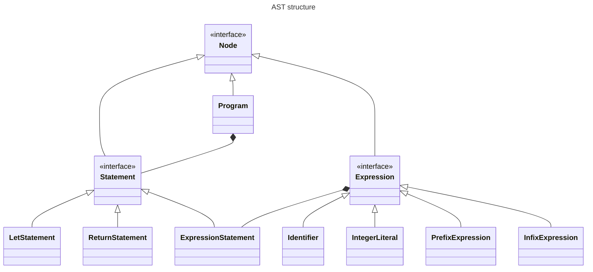
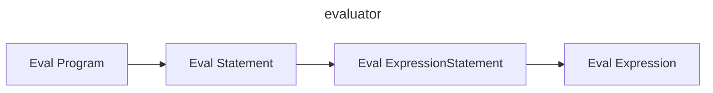
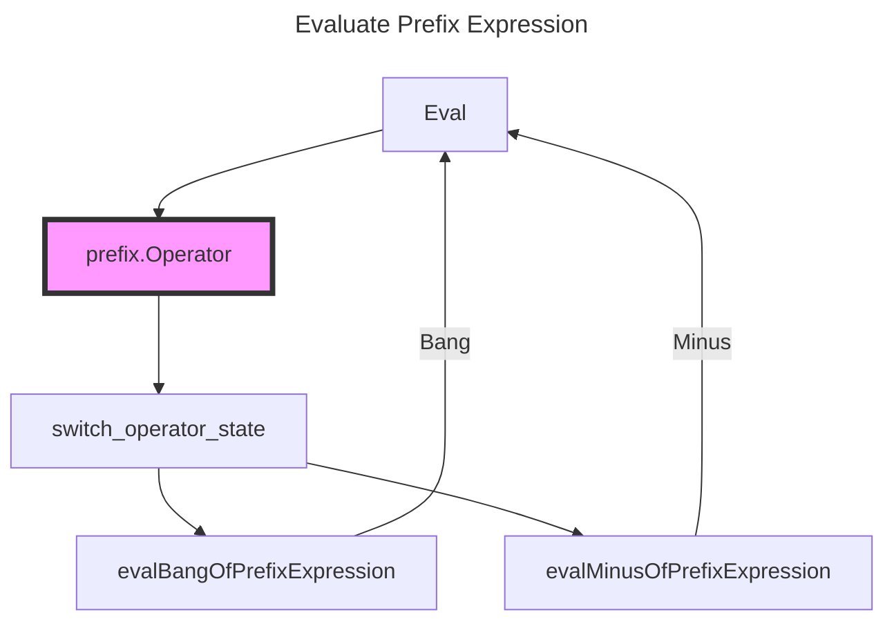

# evaluation

## 3.1 - Giving Meaning to symbols

`Evaluation`,The `E` in `REPL` and the last thing an interpreter has to do when processing source code.**This is where code becomes meaningful.**

The evaluation process of a interpreter defines how the programming language being interpreted works, for example:

```js
let num = 5;

if (num) {
  return a;
} else {
  return b;
}
```

Whether this return `a` or `b` depends on the decision of the interpreter's evaluation process whether the integer `5` is true or not.

## 3.2 - Strategies of Evaluation

Evaluation is also where interpreter implementations diverge the most.There are a lot of different strategies to choose from when evaluating source code.so looking at different options is worthwhile.

Before we start, though, it's also worthy noting again **that the line between interpreter and compiler is a blurry one.**

>tree-walking interpreter

the most obvious and classical choice of what to do with the AST is to just interpret it. Traverse the AST,visit each node and do what the node signifies: print a string,add two number, execute a function's body.Sometimes their evaluation is preceded by small optimization that rewrite the AST(e.g. remove unused variable bindings) or convert it into another `intermediate representation(IR)` that's more suitable for recursive and repeated evaluation.

>bytecode

Other interpreter also traverse the AST, but instead of interpreting the AST itself they first convert it to `bytecode`. Bytecode is another `IR` of the AST and a really dense one at that. The exact format and the `opcodes`(the instructions that make up the bytecode) it is composed of vary and depend on the guest and host programming languages.**In general though, the opcodes are pretty similar to the mnemonics of most assembly languages;**It's safe bet to say that most bytecode definitions contain opcodes for `push` and `pop` to do stack operations.But bytecode is not native machine code, nor is it assembly language.It can't and won't be executed by the operating system and the CPU of the machine where the interpreter is running on.**Instead it's interpreted by a virtual machine, that's the part of the interpreter.**Just like VMWare and VirtualBox emulate real machines and CPUs, these virtual machine emulate a machine that understands this particular bytecode format.This approach can yield great performance benefits.

> A variation of this strategy doesn't involve an AST at all. Instead of building an AST the parser emits bytecodes directly.

In this situation, it is more like a compiler. As we mentioned before, the line becomes blurry.

And to make it even more fuzzy, consider this: some implementations of programming languages parse the source code, build an AST and convert this AST to bytecode.But instead of executing the operations specified by the bytecodes directly in a virtual machine, the virtual machine then compiles the bytecode to native machine code, right before is executed - **just in time**. This is called a `JIT` interpreter/compiler.





The choice of which strategy to choose largely depends on performance and portability needs, the programming language that's being interpreted and how far you're willing to go.

### 3.4 - Representing Objects

Let's say we are evaluating the following monkey code:

```js
let a = 5;

a + a;
```

We're binding the integer literal 5 to the variable `a`. In order to evaluate **a + a** we need to get to the 5.In the AST it's represented as an `*ast.IntegerLiteral`, but how are we going to keep track of and represent the `5` while we're evaluating the rest of the AST?

There are a lot of different choices when building an internal representation of values in an interpreted language.

1. Some use native types(integers, booleans, etc.) of the host language to represent values in the interpreted language, not wrapped in anything.
2. In some language values/Objects are represented only as pointers.
3. in some language native types and pointers are mixed.

### Foundation of our Object system

Carefree as we still are about the performance of our monkey programming, we choose the easy way : **we're going to represent every value we encounter when evaluating monkey source code as an Object, an interface of our design.** Every value will be wrapped in a structure, which fulfills this object interface.

```go
type ObjectType string

// Object represent an object
// looks a lot like we did in the token package with the Token and TokenType types.
// Except that instead of being a structure like Token the Object type is an interface.
// The reason is that every value needs a different internal representation, and it's easier to define two
// different struct types than trying to fit booleans and integers into the same struct field.
type Object interface {
	Type() ObjectType
	Inspect() string
}
```

### Integer, Boolean, Null

object.Null is a structure just like object.Boolean and object.Integer, except that it doesn't wrap any value. It represnets the absence of any value.

```go
type Integer struct {
	Value int64
}

func (i *Integer) Type() ObjectType {
	return ObjectInteger
}

func (i *Integer) Inspect() string {
	return strconv.FormatInt(i.Value, 10)
}

type Boolean struct {
	Value bool
}

func (b *Boolean) Type() ObjectType {
	return ObjectBoolean
}

func (b *Boolean) Inspect() string {
	return fmt.Sprintf("%t", b.Value)
}

type Null struct {
}

func (n *Null) Type() ObjectType {
	return ObjectNull
}

func (n *Null) Inspect() string {
	return "null"
}
```

## 3.5 - Evaluating Expressions

Before we get started, let's review our AST structure.



1. There are two different structs inherit from `Node`, called `Statement` and `Expression`
2. `Program` composite `Statement`, `ExpressionStatement` composite `Expression`
3. **So we need to traverse the program and evaluate each Statement within the program. Meanwhile, we can evaluate Expressions through ExpressionStatement.Expression.**

Then we begin evaluating expressions : **We should always start at the top of the tree, receiving an `*ast.Program`, and then traverse every Node in it.**

Here is what the signature of `Eval` will look like in its first version: it takes ast.Node as input and return an object.Object.

```go
func Eval(node ast.Node) object.Object
```

and the Eval look like:

```go
func Eval(node ast.Node) object.Object {
	switch node := node.(type) {
	case *ast.Program:
		return evalStatements(node.Statements)
	case *ast.ExpressionStatement:
		return Eval(node.Expr)
	case *ast.IntegerLiteral:
		return evalIntegralLiteral(node)
	default:
		panic(fmt.Errorf("error node type for [%s]", reflect.TypeOf(node).String()))
	}
}

func evalIntegralLiteral(integerLiteral *ast.IntegerLiteral) object.Object {
	return &object.Integer{Value: integerLiteral.Value}
}

func evalStatements(stmts []ast.Statement) object.Object {
	var result object.Object
	for _, stmt := range stmts {
		// TODO a sequence of stmt should be evaluate
		result = Eval(stmt)
	}
	return result
}
```



### REPL

we got a lot of statement/expression to support:

1. IntegerLiteral
2. Boolean
3. Null
4. PrefixExpression

### PrefixExpression

```go
func Eval(node ast.Node) object.Object {
	switch node := node.(type) {
	// ...
	case *ast.PrefixExpression:
		return evalPrefixExpression(node)
	// ...
	}
}
```

do eval prefix expression

```go
func evalPrefixExpression(prefix *ast.PrefixExpression) object.Object {
	switch prefix.Operator {
	case string(token.BANG):
		return evalBangOfPrefixExpression(prefix.Right)
	case string(token.SUB):
		return evalMinusOfPrefixExpression(prefix.Right)
	default:
		panic(common.ErrUnknownToken)
	}
}

func evalBangOfPrefixExpression(rightExpr ast.Expression) object.Object {
	right := Eval(rightExpr)
	switch right {
	case object.NativeFalse:
		return object.NativeTrue
	case object.NativeNull:
		return object.NativeTrue
	case object.NativeTrue:
		return object.NativeFalse
	default:
		return object.NativeFalse
	}
}

func evalMinusOfPrefixExpression(rightExpr ast.Expression) object.Object {
	right := Eval(rightExpr)
	if right.Type() != object.ObjInteger {
		// TODO think of it, return NativeNull or panic
		return object.NativeNull
	}
	integer := right.(*object.Integer)
	return &object.Integer{Value: -integer.Value}
}
```

The workflow of our code is as follow:



### 3.6 - Conditionals

The only hard thing about their implementation is deciding when to evaluate what.Because that's the whole point of Conditionals: only ever evaluate something based on a condition.Considering this:

```js
if (x > 10) {
    puts("everything okay!");
} else {
    puts("x is too low!");
    shutdownSystem();
}
```

When evaluating this if-else-expression the important thing is to only evaluate the correct branch.In the case of monkey programming language,the consequence part of the condition will be evaluated when condition is `truthy`. **And truthy means: it's not null and it's not false.**It doesn't necessary to be true.

```js
let x = 10;
// condition is truthy
if (x) {
    puts("everything okay!");
} else {
    puts("x is too low!");
    shutdownSystem();
}
```

### 3.7 - Return Statements

Return statements `stop`  the evaluation of a series of statements and leave behind the value thiere expression has evaluated to.

Here is a top-level return statement in monkey program:

```js
5 * 5 * 5
return 10
10 * 10 * 10
```

When evaluated this program should return 10.If these statements were the body of a function, calling the function should evaluate to 10.The important thing is that the last line, 9 * 9 * 9 expression, is never going to evaluated.

In Go, in order to support return statements, we'll be passing by a "return value" through our evaluator.Whenever we encounter a `return` we'll wrap the value it's supposed to return inside an object, so we can keep track of it.And we need to keep track with it so we can decide whether to stop evaluation or not.

### 3.8 - Abort!Abort!There's been a mistake!, or : Error Handling

Remember all the `NativeNull` we were returning earlier and I said that you shouldn't worry and we'll come back to them? Here we are. It's time to implement some real error handling in monkey before it's too late and we'd have to backpedal too much.

First of all, let's define what I mean with "real error handling".It is **not user-defined** exceptions.It's internal error handling.Errors for wrong operators, unsupported operations, and other user or internal error that may arise during execution.

The error handling is implemented in nearly the same way as handling return statements is.

### 3.9 - Bindings & The Environment

Up next we're going to add bindings to our interpreter by adding support for let statemens.But not only do we need to support let statements, no, we need to support the evaluation of identifiers, too.Let's say we have evaluated the following piece of code:

```js
let x = 5 * 5;
```

Only adding support for the evaluation of this statement is not enought. We also need to make sure that the `x` evaluates to `25` after interpreting the line above.

We evaluate let statements by evaluating their value-produced expression and keeping track of the produced value under the specified name.To evaluate identifiers we check if we already have a value bound to the name.If we do, the identifier evaluates to the value, and if we don't, we return an error.

The first thing we have need to `Eval` the expression of the let statement:

```js
func Eval(node ast.Node) object.Object {
	switch node := node.(type) {
	// ...
	case *ast.LetStatement:
		return evalLetStatement(node)
	// ...
	}
}
```

The question is : How tdo we keep track of values? We have the value and we have the name we should bind ti too, `node.Name.Value`.How do we associate one with the other?

**This is where something called the environment comes into play. The environment is what we use to keep track of value by associating them with a name.**

```go
func NewEnvironment() *Environment {
	return &Environment{store: make(map[string]Object)}
}

type Environment struct {
	store map[string]Object
}

func (env *Environment) Get(name string) Object {
	return env.store[name]
}

func (env *Environment) Set(name string, obj Object) {
	env.store[name] = obj
}
```


