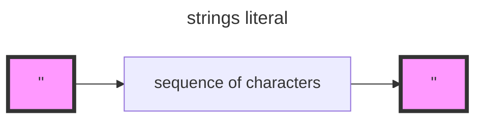

### 4 - Extending the Interpreter

## 4.1 - Data Types & Functions

We will add new token types, modify the lexer, extend the parser and finlally add support for the data types to our evaluator and the object system.Even better is that the data type we're going to add are already present is Go.That means that we only need to make them available in Monky.

In addition to that we're also going to make the interpreter much more powerful by adding some new functions.These new ones, called `built-in functions`.

## 4.2 - Strings

### Supporting Strings in our Lexer

The first thing we have to do is add support for strings literals to our lexer. The basic structure of strings is this:



the following code show the parsing function:

```go
func (l *Lexer) readString() string {
	// skip left quote
	l.readChar()

	buffer := bytes.Buffer{}

	var end = false
	// actually, we should parse the string with a state machine instead of peek char
	for !end {
		switch l.curCh() {
		case '\\':
			// in this case, whatever the next character is, we simply consume it as a basic char
			l.readChar()
			buffer.WriteByte(l.curCh())
			l.readChar()
		case '"':
			end = true
		default:
			buffer.WriteByte(l.curCh())
			l.readChar()
		}
	}

	return buffer.String()
}
```

