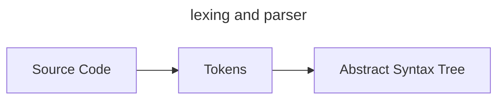
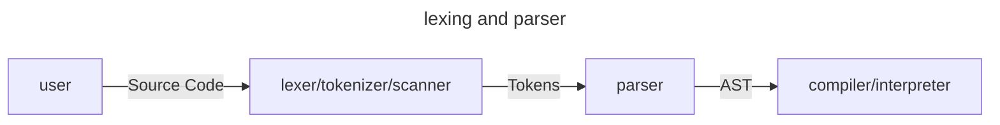

# lexing

## 1.1 - Lexical Analysis

what we need to do is represent our code to other forms that are easier to work with.We're going to change the representation of our source code two times before we evaluate it:




The first transformation, from source code to tokens, is called `lexical analysis`, or `lexing` for short. It's done by a `lexer` (also called `tokenizer` or `scanner`).

Tokens itself are small, easily categorizable data structures that are then fed to the `parser`, which does the second transformation and turns the tokens into an "Abstract Syntax Tree".

the real progress is like the graph below:



Here's an example.This is the input one gives to a lexer:

```javascript
let x = 5 + 5;
```

And what comes out of the lexer looks kind live this:

```javascript
[
  LET,
  IDENTIFER("x"),
  EQUAL_SIGN,
  INTEGER(5),
  PLUS_SIGN,
  INTEGER(5),
  SEMICOLON
]
```

A thing to note about this example: whitespace has been ignored.

## 1.2 - Defining Our Tokens

The subset of the Monkey language we're going to lex in our first step looks like this:

```javascript
let five = 5;
let ten = 10;
let add = fn(x, y) {
  x + y;
}
let result = add(five, ten);
```

Let's break this down: which types of tokens does this example contain?

1. here are the numbers like `5` and `10`.
2. Then we have the variable names `five`, `ten`, `x`, `y`, `add` and `result`.
3. the preserved words `let`, `fn`, not variable name, and not number either.
4. special character : `=`, `;`, `(`, `)`, `{`, `}`.
5. `EOF` stands for end of file.

> so the definitions goes like this, in `token/tokens.go`

```go
package token

// TokenType define tye type of the token
type TokenType string

type Token struct {
	Type    TokenType
	Literal string
}

var keywords = map[string]TokenType{
	"fn":     FUNCTION,
	"let":    LET,
	"return": RETURN,
}

// system info
const (
	ILLEGAL TokenType = "ILLEGAL" // signifies a token/character we don't know
	EOF     TokenType = "EOF"     // end of file
)

// identifiers and literals
const (
	IDENTIFIER TokenType = "IDENTIFIER" // identifier
	INT        TokenType = "INT"        // int
)

// operators
const (
	ASSIGN TokenType = "="
	PLUS   TokenType = "+"
)

// delimiters
const (
	COMMA     TokenType = ","
	SEMICOLON TokenType = ";"

	LPAREN TokenType = "("
	RPAREN TokenType = ")"
	LBRACE TokenType = "{"
	RBRACE TokenType = "}"
)

// preserved keywords
const (
	FUNCTION TokenType = "FUNCTION"
	LET      TokenType = "LET"
	RETURN   TokenType = "RETURN"
)

func LookupIdentifier(identifier string) TokenType {
	if tok, ok := keywords[identifier]; ok {
		return tok
	}
	return IDENTIFIER
}
```

## 1.3 - The Lexer

Before we start to write code, let's be clear about the goal of this section. We're going to write our own lexer. It will take source code as input and output the tokens that represent the source code. It will go through its input and output the next token it recognizes. It doesn't need to buffer or save tokens, since there will only be one method called `NextToken()`, which will output the next token.

The ones that might cause some confusion right now are `position` and `readPosition`. Both will be used to access characters in input by using them as an index, e.g.: l.input[l.readPosition]. **The reason for these two "pointers" pointing into our input string is the fact that we will need to be able to "peek" further into the input and look after the current character to see what comes up next**. readPosition always points to the "next" character in the input. position points to the character in the input that corresponds to the ch byte.

```go
package lexer

import (
	"0x822a5b87/interpreter-go/common"
	"0x822a5b87/interpreter-go/token"
)

const LiteralEof byte = 0

type Lexer struct {
	sourceCode   string
	position     int  // current position in input(points to current char)
	readPosition int  // current reading position in input(after current char)
	ch           byte // current char under examination
}

func NewLexer(source string) *Lexer {
	l := &Lexer{sourceCode: source}
	// init lexer
	l.readChar()
	return l
}

// NextToken get next token from source code
// token.EOF is a const untyped string, and it can be used as token.TokenType due to implicit type conversion
// for further info please read my blog:
// https://0x822a5b87.github.io/2024/07/26/%E5%85%B3%E4%BA%8Egolang%E7%9A%84%E7%B1%BB%E5%9E%8B%E6%8E%A8%E5%AF%BC%E3%80%81%E9%9A%90%E5%BC%8F%E7%B1%BB%E5%9E%8B%E8%BD%AC%E6%8D%A2%E7%9A%84%E4%B8%80%E4%BA%9B%E6%80%9D%E8%80%83/
func (l *Lexer) NextToken() (token.Token, error) {
	// before we parse token, we should skip the whitespace
	l.skipWhitespace()

	var tok token.Token
	var err error
	switch l.ch {
	case LiteralEof:
		tok, err = newToken(token.EOF, l.ch)
	case '=':
		tok, err = newToken(token.ASSIGN, l.ch)
	case '+':
		tok, err = newToken(token.PLUS, l.ch)
	case ',':
		tok, err = newToken(token.COMMA, l.ch)
	case ';':
		tok, err = newToken(token.SEMICOLON, l.ch)
	case '(':
		tok, err = newToken(token.LPAREN, l.ch)
	case ')':
		tok, err = newToken(token.RPAREN, l.ch)
	case '{':
		tok, err = newToken(token.LBRACE, l.ch)
	case '}':
		tok, err = newToken(token.RBRACE, l.ch)
	default:
		if l.isLetter() {
			tok, err = l.readIdentifier(), nil
		} else if l.isDigit() {
			tok, err = l.readNumber(), nil
		} else {
			tok, err = token.Token{Type: token.ILLEGAL, Literal: string(l.ch)}, common.ErrUnknownToken
		}

		// return immediately after parse identifier/number or other specific object
		// because readChar() already called in the function
		return tok, err
	}

	l.readChar()

	return tok, err
}

func (l *Lexer) readIdentifier() token.Token {
	cur := l.position
	for l.isLetter() {
		l.readChar()
	}
	literal := l.sourceCode[cur:l.position]
	identifier := token.LookupIdentifier(literal)
	return token.Token{
		Type:    identifier,
		Literal: literal,
	}
}

func (l *Lexer) readNumber() token.Token {
	cur := l.position
	for l.isDigit() {
		l.readChar()
	}
	return token.Token{
		Type:    token.INT,
		Literal: l.sourceCode[cur:l.position],
	}
}

func (l *Lexer) isLetter() bool {
	return ('a' <= l.ch && l.ch <= 'z') || ('A' <= l.ch && l.ch <= 'Z') || l.ch == '_'
}

func (l *Lexer) isDigit() bool {
	return '0' <= l.ch && l.ch <= '9'
}

func newToken(tokenType token.TokenType, ch byte) (token.Token, error) {
	return token.Token{
		Type:    tokenType,
		Literal: string(ch),
	}, nil
}

func (l *Lexer) readChar() {
	if l.readPosition >= len(l.sourceCode) {
		l.ch = LiteralEof
	} else {
		l.ch = l.sourceCode[l.readPosition]
	}

	// should we use l.position++ instead of the code? absolutely not!
	// if we use l.position++, then position and readPosition will be permanently the same
	l.position = l.readPosition
	l.readPosition++
}

func (l *Lexer) skipWhitespace() {
	for l.ch == ' ' || l.ch == '\n' || l.ch == '\t' || l.ch == '\r' {
		l.readChar()
	}
}

// curStr convert current ch to string, mainly for debugging
func (l *Lexer) curStr() string {
	return string(l.ch)
}
```

### 1.4 - Extending out Token Set and Lexer

In order to eliminate the need to jump between packages when later writing our parser, we need to extend our lexer so it can recognize more of the Monkey language and output more tokens. So in this section we will add support for `==`, `!`, `!=`, `-`, `/`, `*`, `<`, `>` and the keywords true, false, if,else and return.

The new tokens we will need to add, build and output can be classified as one of these three:

1. character token (e.g. `-`)
2. two-character token (e.g. `==`) 
3. keyword token (e.g. `return`). 

We already know how to handle one-character and keyword tokens, so we add support for these first,before extending the lexer for two-character tokens.

#### tokens that are composed of two characters

> in this section, we want to support the tokens which looks like this in the source code : `==`, `!=`, etc.

At first glance you may be thinking: "why not add a new case to our `switch` statement and be done with it?" Since our switch statement takes the current character `l.ch` as the expression to compare against the cases, we can't just add new cases like case `==` - the compiler won't let us. 

We can't compare our l.ch byte with strings like "==". **What we can do instead is to reuse the existing branches for '=' and '!' and extend them.** So what we're going to do is to look ahead in the input and then determine whether to return a token for = or ==. After extending input in lexer/lexer_test.go again, it now looks like this:

```go
func (l *Lexer) NextToken() (token.Token, error) {
	// ...
	case '=':
		if l.peakChar() == '=' {
			ch := l.ch
			l.readChar()
			tok, err = newTokenForBinary(token.EQ, ch, l.ch)
		} else {
			tok, err = newToken(token.ASSIGN, l.ch)
		}
	case '!':
		if l.peakChar() == '=' {
			ch := l.ch
			l.readChar()
			tok, err = newTokenForBinary(token.NotEq, ch, l.ch)
		} else {
			tok, err = newToken(token.BANG, l.ch)
		}
	// ...
}


func (l *Lexer) peakChar() byte {
	if !l.hasNextChar() {
		return LiteralEof
	} else {
		return l.sourceCode[l.readPosition]
	}
}
```

If we were to start supporting more two-character tokens in Monkey, we should probabaly abstract the behaviour away in a method called `makeTwoCharToken` that peeks and advances if it found the right token.

### 1.5 - Start of a REPL

**REPL** stands for **Read Eval Print Loop**.Sometimes the REPL is called the `console` or `interactive mode`.the REPL read input, sends it to the interpreter for evaluation, prints the result/ouput of the interpreter and starts again.
