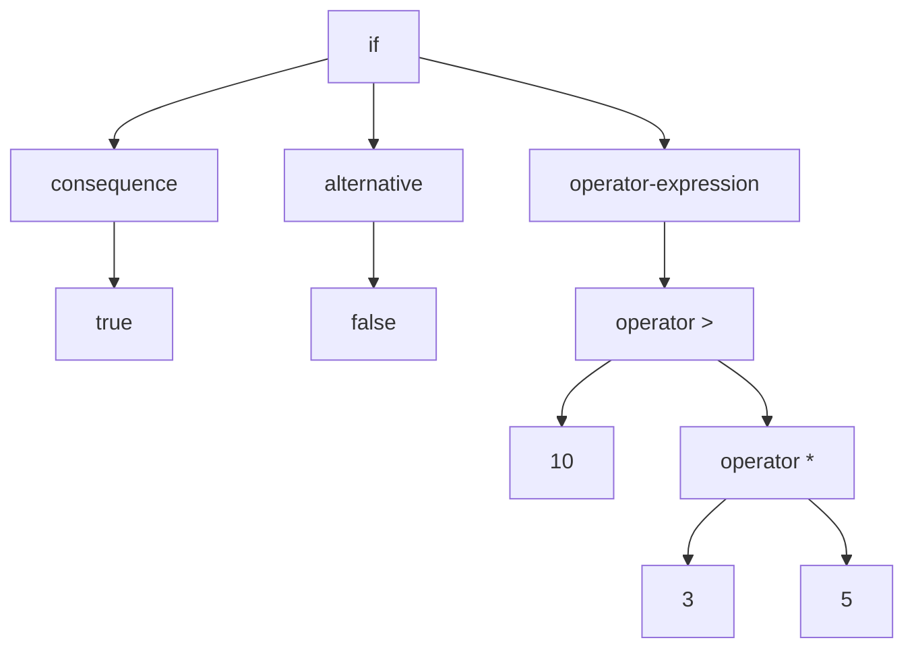
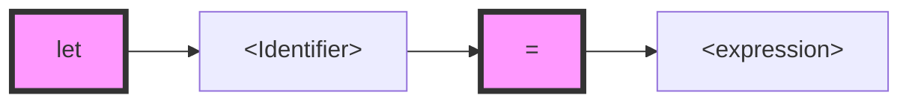
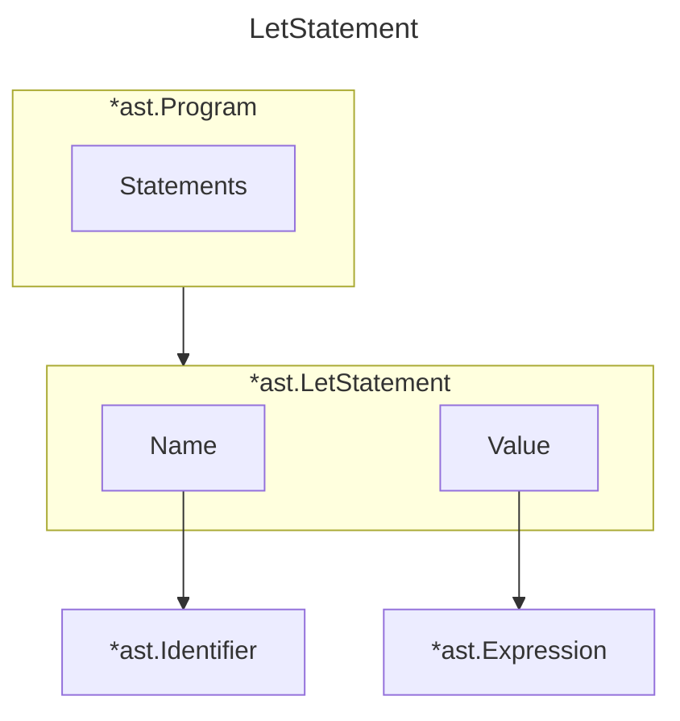
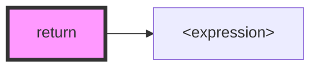

# parsing

## 2.1 - Parsers

A parser is a software component that takes input data(frequently text) and builds a data structure - ofthen some kind of parse tree, abstract synctax tree or other hierarchical structure - giving a structure representation of thi input, checking for correct syntax in the process.**The parser is often preceded by a separate lexical analyser, which creates tokens from the sequence of input characters.**

A fact to notice is that there is no one true, universal AST format that's used by every parser.Their implementation are all pretty similar, the concept is the same, but they differ in details.The concrete implementation depending on the programming language being parsed.

Let's say we have code below :

```javascript
if (3 * 5 < 10) {
  return true;
} else {
  return false;
}
```

the output AST mabey like this :



this is what parser do. They take source code as input(either as text or tokens) and produce a data structure which represents this source code.While building up the data structure, they unavoidably analyse the input, checking that it conforms to the expected structure.Thus the process of parsing is also called **syntactic analysis**.

## 2.2 - Why not a parser generator?

Maybe you've already heared about parser generators, like the tools yacc, bison or ANTLR.Parser generator are tooks that, when fed with a formal description of a language, produce parsers as their output.This output code that can then be compiled/interpreted and itself fed with source code as input to produce a syntax tree.

The majority of them use a `context-free grammer(CFG)` as their input. The most common notational formats of CFGs are the `BNF` or `EBNF`.

Also many people said, "it's a solved problem".I don't think that learning to write your own parser is a waste of time.I actually think it's immensely valuable.**Only after having written your own parser, or at least attempted to, will you see the benifits parser generators provide, the drawback they have and the problem the solve.**

## 2.3 - writing a Parser for the monkey Programming Language

There are two main strategies when parsing a programming language: `top-down` parsing or `bottom-up` parsing. A lot of slightly different forms of each strategy exist.For example, "recursive descent parsing", "Early parsing" or "predictive parsing" are all variations of top-down parsing.

> Let me just say, that the difference between `top-down` and `bottom-up` parsers is that the former starts with **constructing root node of the AST and then descends **while the latter does  it the other way around

We're going to start by parsing statements : `let` and `return` statements.When we can parse statements and the basic structure of our parser stands, we will look at expressions and how to parse these.Afterwards we extend the parser to make it capable of parsing a large subset of monkey Programming Language.As we go along we build up the necessary structures for our AST.

## 2.4 - Parser's first steps: parsing let statement

In monkey, variable bindings are statements of the following form:

```javascript
// assign the variable to a literally value
let x = 5;

// assign the variable to function execution result 
let foo_bar = add(5, 5);

// assign the variable to an expression
let bar_foo = 5 * 5 / 10 + 18 - add(5, 5) + multiply(124);

// assign the variable to another variable
let anotherName = bar_foo
```

Here is a fully valid program written in monkey:

```javascript
let x = 10;
let y = 15;

let add = fn(a, b) {
  return a + b
};
```

in this example we can see three statements, three variable binding - let statements - of the following form.A let statement in monkey consist of two changing parts : an `<identifier>` and an `<expression>`.



Here is a basic define:

```go
package ast

// Node every node in our AST has to implement the Node interface
// meaning it has to provide a TokenLiteral() function that returns the literal value of the token it's associated with.
// TokenLiteral() will used only for debugging and testing.
// The AST we are going to construct consists solely of Nodes that are connected to each other.
type Node interface {
	TokenLiteral() string
}

// Statement a statement is a complete unit of execution in a program.
// Statements typically perform an action, such as assigning a value to a variable,
// calling a function, or controlling the flow of the program.
// Statement DO NOT produce value.
type Statement interface {
	Node
	statementNode()
}

// Expression an expression is a combination of variables, constants, operators, and functions that are evaluated to produce a value.
// it can be simple, like a constant or variable, or complex, involving multiple operations.
// it can be nested with other expressions or statement.
// Expression produce value.
type Expression interface {
	Node
	expressionNode()
}
```

```go
type Identifier struct {
	Token token.Token
	Value string
}

type LetStatement struct {
	Token token.Token
	Name  *Identifier // Name the name of variable
	Value Expression  // Value expression represent the right side of the 
}

func (identifier *Identifier) expressionNode() {}

func (identifier *Identifier) TokenLiteral() string {
	return identifier.Token.Literal
}

func (ls *LetStatement) statementNode() {}

func (ls *LetStatement) TokenLiteral() string {
	return ls.Token.Literal
}
```

With `Program`, `LetStatement`, `Identifier` defined this monkey source code:

```javascript
let x = 5;
```

could be represented by an AST looking like this : 




Now before we start writing tests and filling out the `ParseProgram` I want to show you the basic idea and structure behind a recursive descent parser. That makes it a lot easier to understand  out own parser later on. What follows are the major parts of such a parser in pseudocode.

```go
// pseudocode

// parseProgram entry for parse program
function parseProgram() {
  program = newProgramASTNode()
  advanceTokens()
  
  for (currentToken != EOF_TOKEN) {
    statement = null
    
    if (currentToken == LET_TOKEN) {
      // step into parse let statement
      statement = parseLetStatement()
    } else if (currentToken == RETURN_TOKEN) {
      statement = parseReturn()
    } else if (currentToken == IF_TOKEN) {
      statement = parseIf()
    }
    
    if (statement != null) {
      program.Statemens.push(statement)
    }
    
    advanceTokens()
  }
  
  return program
}

function parseStatement() {
  advanceTokens()
  identifier = parseIdentifier()
  advanceTokens()
  
  if currentToken() != EQUAL_TOKEN {
    parseError("equal sign expected")
    return nil
  }
  advanceTokens()
  value = parseExpression()
  
  variableStatement = newVariableStatementASTNode()
  variableStatement.identifier = identifier
  variableStatement.value = value
  
  return variableStatement
}

function parseIdentifier() {
  identifier = newIdentifierASTNode()
  identifier.token = currentToken()
  return identifier
}

function parseExpression() {
  if (currentToken() == INTEGER_TOKEN) {
    if (peekToken() == SEMICOLON_TOKEN) {
      // encounter semicolon, return literal value
      return parseIntegerLiteral()
    }
    
    if (peekToken() == OPERATOR_TOKEN) {
      return parseOperatorExpression()
    }
  } else if (currentToken() == LEFT_PAREN) {
    return parseGroupedExpression()
  }
  // [...]
}
```

> we can see what the parser has todo. It repeatedly advances the tokens and checks the current token to decide what to do next: either call another parsing function or throw an error.Each function then does its job and possibly constructs an AST node so that the "main loop" in `parseProgram()` can advance the tokens and decide what to do again. 

Again, we're starting a test before we flesh out *ParseProgram*.Here is a test case to make sure that the parsing of let statements works:

```go
func TestParseProgram(t *testing.T) {
	input := `
let x = 5;
let y = 10;

let foo_bar = 510;
`
	l := lexer.NewLexer(input)
	p := NewParser(*l)
	program := p.ParseProgram()

	if program == nil {
		t.Fatal("ParseProgram return nil")
	}

	if len(program.Statements) != 3 {
		t.Fatalf("program.Statements does not contain 3 statements. got %d", len(program.Statements))
	}

	expectedStatements := []struct {
		expectedIdentifier string
	}{
		{"x"},
		{"y"},
		{"foo_bar"},
	}

	for i, expectedStatement := range expectedStatements {
		stmt := program.Statements[i]
		if !testLetStatement(t, stmt, expectedStatement.expectedIdentifier) {
			t.Fatalf("line [%d], expected [%s], got [%s]", i, expectedStatement.expectedIdentifier, stmt.TokenLiteral())
		}
	}
}

func testLetStatement(t *testing.T, stmt ast.Statement, name string) bool {
	if stmt.TokenLiteral() != "let" {
		t.Errorf("letStmt.TokenLiteral() not 'let', got [%s]", stmt.TokenLiteral())
	}

	letStmt, ok := stmt.(*ast.LetStatement)
	if !ok {
		t.Errorf("stmt not *ast.LetStatement, got = %T", stmt)
	}

	if letStmt.Name.Value != name {
		t.Errorf("letStmt.Name.Value != name, expected [%s], got [%s]", name, letStmt.Name.Value)
	}

	if letStmt.Name.TokenLiteral() != name {
		t.Errorf("letStmt.Name.TokenLiteral() != name, expected [%s], got [%s]", name, letStmt.Name.TokenLiteral())
	}

	return true
}
```

## 2.5 - Parsing Return Statements

Here is wht return statements look like in monkey:

```javascript
// return literal value
return 5;

// return identifier
return x;

// return function
return add;

// return expression
return 10 + 5;
return add(15);
```

Experienced with let statements, we can easily spot the structure behind these statements:



```go
type ReturnStatement struct {
	Token       token.Token
	ReturnValue *Expression
}

func (r *ReturnStatement) TokenLiteral() string {
	return r.Token.Literal
}

func (r *ReturnStatement) statementNode() {}
```

