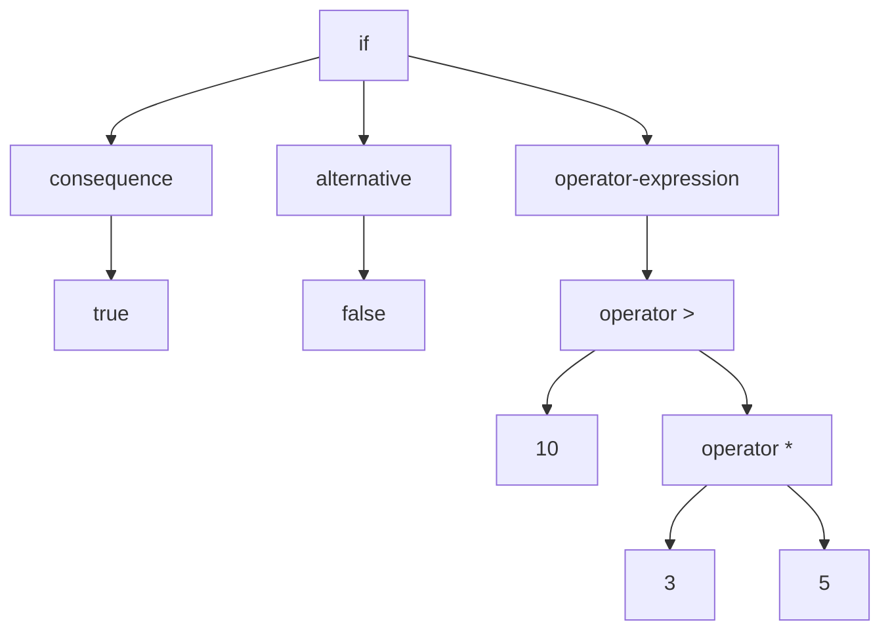
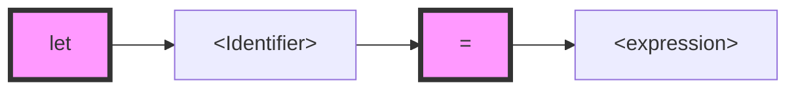
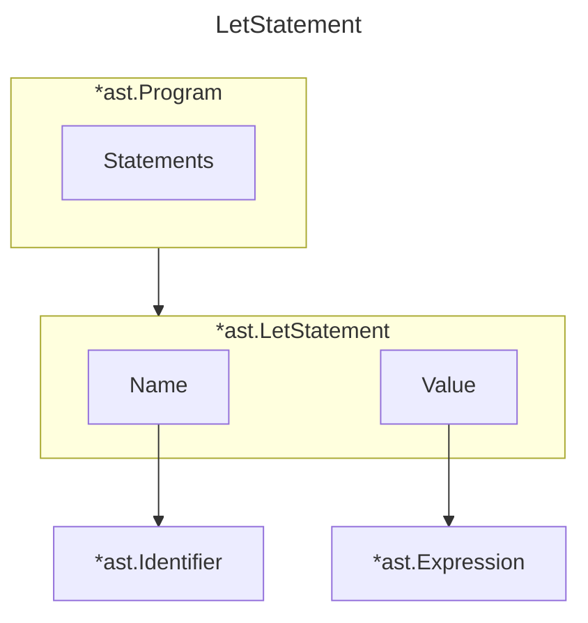
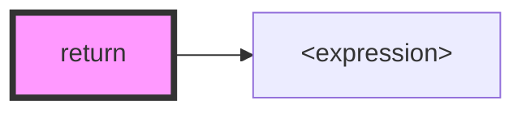
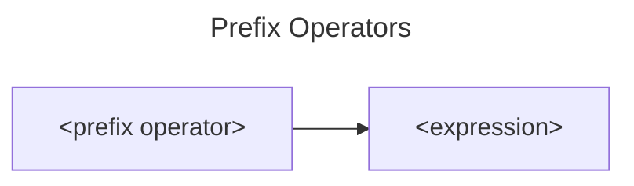
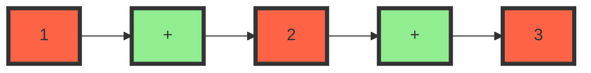
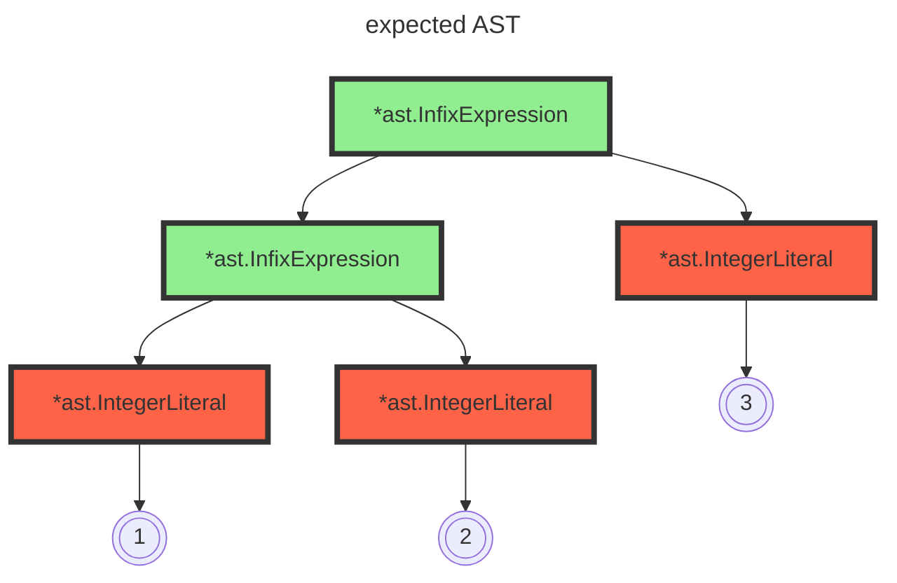
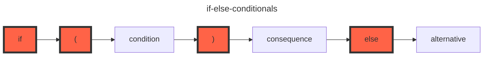
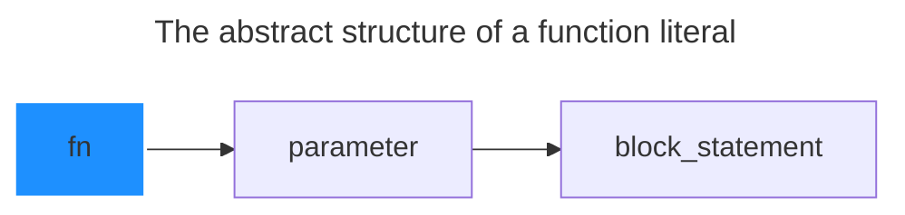

# parsing

## 2.1 - Parsers

A parser is a software component that takes input data(frequently text) and builds a data structure - ofthen some kind of parse tree, abstract synctax tree or other hierarchical structure - giving a structure representation of thi input, checking for correct syntax in the process.**The parser is often preceded by a separate lexical analyser, which creates tokens from the sequence of input characters.**

A fact to notice is that there is no one true, universal AST format that's used by every parser.Their implementation are all pretty similar, the concept is the same, but they differ in details.The concrete implementation depending on the programming language being parsed.

Let's say we have code below :

```javascript
if (3 * 5 < 10) {
  return true;
} else {
  return false;
}
```

the output AST mabey like this :



this is what parser do. They take source code as input(either as text or tokens) and produce a data structure which represents this source code.While building up the data structure, they unavoidably analyse the input, checking that it conforms to the expected structure.Thus the process of parsing is also called **syntactic analysis**.

## 2.2 - Why not a parser generator?

Maybe you've already heared about parser generators, like the tools yacc, bison or ANTLR.Parser generator are tooks that, when fed with a formal description of a language, produce parsers as their output.This output code that can then be compiled/interpreted and itself fed with source code as input to produce a syntax tree.

The majority of them use a `context-free grammer(CFG)` as their input. The most common notational formats of CFGs are the `BNF` or `EBNF`.

Also many people said, "it's a solved problem".I don't think that learning to write your own parser is a waste of time.I actually think it's immensely valuable.**Only after having written your own parser, or at least attempted to, will you see the benifits parser generators provide, the drawback they have and the problem the solve.**

## 2.3 - writing a Parser for the monkey Programming Language

There are two main strategies when parsing a programming language: `top-down` parsing or `bottom-up` parsing. A lot of slightly different forms of each strategy exist.For example, "recursive descent parsing", "Early parsing" or "predictive parsing" are all variations of top-down parsing.

> Let me just say, that the difference between `top-down` and `bottom-up` parsers is that the former starts with **constructing root node of the AST and then descends **while the latter does  it the other way around

We're going to start by parsing statements : `let` and `return` statements.When we can parse statements and the basic structure of our parser stands, we will look at expressions and how to parse these.Afterwards we extend the parser to make it capable of parsing a large subset of monkey Programming Language.As we go along we build up the necessary structures for our AST.

## 2.4 - Parser's first steps: parsing let statement

In monkey, variable bindings are statements of the following form:

```javascript
// assign the variable to a literally value
let x = 5;

// assign the variable to function execution result
let foo_bar = add(5, 5);

// assign the variable to an expression
let bar_foo = 5 * 5 / 10 + 18 - add(5, 5) + multiply(124);

// assign the variable to another variable
let anotherName = bar_foo
```

Here is a fully valid program written in monkey:

```javascript
let x = 10;
let y = 15;

let add = fn(a, b) {
  return a + b
};
```

in this example we can see three statements, three variable binding - let statements - of the following form.A let statement in monkey consist of two changing parts : an `<identifier>` and an `<expression>`.



Here is a basic define:

```go
package ast

// Node every node in our AST has to implement the Node interface
// meaning it has to provide a TokenLiteral() function that returns the literal value of the token it's associated with.
// TokenLiteral() will used only for debugging and testing.
// The AST we are going to construct consists solely of Nodes that are connected to each other.
type Node interface {
	TokenLiteral() string
}

// Statement a statement is a complete unit of execution in a program.
// Statements typically perform an action, such as assigning a value to a variable,
// calling a function, or controlling the flow of the program.
// Statement DO NOT produce value.
type Statement interface {
	Node
	statementNode()
}

// Expression an expression is a combination of variables, constants, operators, and functions that are evaluated to produce a value.
// it can be simple, like a constant or variable, or complex, involving multiple operations.
// it can be nested with other expressions or statement.
// Expression produce value.
type Expression interface {
	Node
	expressionNode()
}
```

```go
type Identifier struct {
	Token token.Token
	Value string
}

type LetStatement struct {
	Token token.Token
	Name  *Identifier // Name the name of variable
	Value Expression  // Value expression represent the right side of the
}

func (identifier *Identifier) expressionNode() {}

func (identifier *Identifier) TokenLiteral() string {
	return identifier.Token.Literal
}

func (ls *LetStatement) statementNode() {}

func (ls *LetStatement) TokenLiteral() string {
	return ls.Token.Literal
}
```

With `Program`, `LetStatement`, `Identifier` defined this monkey source code:

```javascript
let x = 5;
```

could be represented by an AST looking like this :




Now before we start writing tests and filling out the `ParseProgram` I want to show you the basic idea and structure behind a recursive descent parser. That makes it a lot easier to understand  out own parser later on. What follows are the major parts of such a parser in pseudocode.

```go
// pseudocode

// parseProgram entry for parse program
function parseProgram() {
  program = newProgramASTNode()
  advanceTokens()

  for (currentToken != EOF_TOKEN) {
    statement = null

    if (currentToken == LET_TOKEN) {
      // step into parse let statement
      statement = parseLetStatement()
    } else if (currentToken == RETURN_TOKEN) {
      statement = parseReturn()
    } else if (currentToken == IF_TOKEN) {
      statement = parseIf()
    }

    if (statement != null) {
      program.Statemens.push(statement)
    }

    advanceTokens()
  }

  return program
}

function parseStatement() {
  advanceTokens()
  identifier = parseIdentifier()
  advanceTokens()

  if currentToken() != EQUAL_TOKEN {
    parseError("equal sign expected")
    return nil
  }
  advanceTokens()
  value = parseExpression()

  variableStatement = newVariableStatementASTNode()
  variableStatement.identifier = identifier
  variableStatement.value = value

  return variableStatement
}

function parseIdentifier() {
  identifier = newIdentifierASTNode()
  identifier.token = currentToken()
  return identifier
}

function parseExpression() {
  if (currentToken() == INTEGER_TOKEN) {
    if (peekToken() == SEMICOLON_TOKEN) {
      // encounter semicolon, return literal value
      return parseIntegerLiteral()
    }

    if (peekToken() == OPERATOR_TOKEN) {
      return parseOperatorExpression()
    }
  } else if (currentToken() == LEFT_PAREN) {
    return parseGroupedExpression()
  }
  // [...]
}
```

> we can see what the parser has todo. It repeatedly advances the tokens and checks the current token to decide what to do next: either call another parsing function or throw an error.Each function then does its job and possibly constructs an AST node so that the "main loop" in `parseProgram()` can advance the tokens and decide what to do again.

Again, we're starting a test before we flesh out *ParseProgram*.Here is a test case to make sure that the parsing of let statements works:

```go
func TestParseProgram(t *testing.T) {
	input := `
let x = 5;
let y = 10;

let foo_bar = 510;
`
	l := lexer.NewLexer(input)
	p := NewParser(*l)
	program := p.ParseProgram()

	if program == nil {
		t.Fatal("ParseProgram return nil")
	}

	if len(program.Statements) != 3 {
		t.Fatalf("program.Statements does not contain 3 statements. got %d", len(program.Statements))
	}

	expectedStatements := []struct {
		expectedIdentifier string
	}{
		{"x"},
		{"y"},
		{"foo_bar"},
	}

	for i, expectedStatement := range expectedStatements {
		stmt := program.Statements[i]
		if !testLetStatement(t, stmt, expectedStatement.expectedIdentifier) {
			t.Fatalf("line [%d], expected [%s], got [%s]", i, expectedStatement.expectedIdentifier, stmt.TokenLiteral())
		}
	}
}

func testLetStatement(t *testing.T, stmt ast.Statement, name string) bool {
	if stmt.TokenLiteral() != "let" {
		t.Errorf("letStmt.TokenLiteral() not 'let', got [%s]", stmt.TokenLiteral())
	}

	letStmt, ok := stmt.(*ast.LetStatement)
	if !ok {
		t.Errorf("stmt not *ast.LetStatement, got = %T", stmt)
	}

	if letStmt.Name.Value != name {
		t.Errorf("letStmt.Name.Value != name, expected [%s], got [%s]", name, letStmt.Name.Value)
	}

	if letStmt.Name.TokenLiteral() != name {
		t.Errorf("letStmt.Name.TokenLiteral() != name, expected [%s], got [%s]", name, letStmt.Name.TokenLiteral())
	}

	return true
}
```

## 2.5 - Parsing Return Statements

Here is wht return statements look like in monkey:

```javascript
// return literal value
return 5;

// return identifier
return x;

// return function
return add;

// return expression
return 10 + 5;
return add(15);
```

Experienced with let statements, we can easily spot the structure behind these statements:



```go
type ReturnStatement struct {
	Token       token.Token
	ReturnValue *Expression
}

func (r *ReturnStatement) TokenLiteral() string {
	return r.Token.Literal
}

func (r *ReturnStatement) statementNode() {}
```

## 2.6 - Pasing Expressions

As we just saw,parsing statements is relatively straightforward.We process tokens from **left to right**,except or reject the next tokens and if anything fits we return an AST node.

Parsing Expressions,on the other hands,contains a few more challenge.**Operator precedence** is probably the first one that comes to mind and is best illustrated with a example.Lets say we want to parse the following arithmetic expressions:

```go
5 * 5 + 10
```

what we want here is an AST that represents hte expression like this:

```go
((5 * 5) + 10)
```

In order to produce an AST that looks like this, the parser has to know about operator precedences where the precedence of `*` is higher than `+`.


Here is another typical example:

```go
5 * (5 + 10)
```

Here the parenthesis group together the `5 + 10` expression and give them a **"precedence bump"**: the addition now has to be evaluated before the multiplication.

The other big challenge is that in expressions tokens of the same type can appear in multiple position.

```go
// negative number in expression
let x = -10 + 10

// function in expression
let y = 5 + add(5, 5) * 10
```

### Expression in monkey

> In the monkey programming language everything besides *let* and *return* statements is an expression.These expressions come in differencet varieties.

```javascript
let negative = -1
let falseExpression = false
let falseExpression1 = !true

let addExpression = 5 + 5
let subExpression = 5 - 5
let mulExpression = 5 * 5
let divExpression = 5 / 5

// comparision operators
foo = bar
foo != bar
foo < bar
foo > bar

// call expressions
add(2, 3)
add(add(2, 3), add(5, 10))
max(5, add(5 * 5))

// identifiers are expression too
foo * bar / foo_bar
add(foo, bar)
```

**functions in monkey are first-class citizens and, yes, function literals are expressions too.**We can use a let statement to bind a function to a name.The function literal is just the expression in the statement:

```javascript
let add = fn(x, y) {
  return x + y;
};
```

### Top Down Operator Precedence(or: Pratt Parsing)

Top Down Operator Precedence  was invented as an alternative to parsers based on context-free grammars and the BNF.

ANd that is also the main difference: instead of associating parsing `functions` with `grammer rules`, Pratt associates these functions(which he calls "semantic code") with single token types.**A crucial part of the idea is that each token type can have two parsing functions associated with it, depending on the tokens's position** - `infix` or `prefix`

- functions : think of our **parseLetStatement ** method here
- grammer ruls : defined in BNF or EBNF

### Terminology

> A **prefix operator** is an operator "in front of" its operand

```javascript
--5
```

> A **posifix operator** is an operator "after" its operand

```javascript
foo_bar++
```

> A **infix operator** are something we've all seen before. An infix operator sits between its operands

```js
let x = 5 * 8;
```

### Preparing the AST

An expression statement is not really a distinct statement; it's a statement that consists solely of one expression.It's only a wrapper, we need it because it's totally legal in monkey to write the follow code:

```js
let x = 5;

// expression statement
x + 10;
```

we add a String() method to Node for the purpose of debugging

```go
type Node interface {
	TokenLiteral() string
	String() string
}

func (p *Program) String() string {
	buffer := bytes.Buffer{}
	for _, stmt := range p.Statements {
		buffer.WriteString(stmt.String())
	}
	return buffer.String()
}
```

The "real work" happens in the String() method of our three statement types:

```go
func (ls *LetStatement) String() string {
	return fmt.Sprintf("%s %s = %s;", ls.Token.Literal, ls.Name.String(), ls.Value.String())
}

func (r *ReturnStatement) String() string {
	var returnValue = ""
	if r.ReturnValue != nil {
		returnValue = r.ReturnValue.String()
	}

	return fmt.Sprintf("%s %s;", r.Token.Literal, returnValue)
}

func (e *ExpressionStatement) String() string {
	if e.Expr != nil {
		return e.Expr.String()
	}
	return ""
}
```

and we can write the following test code:

```go
func TestLetStatementString(t *testing.T) {
	program := Program{Statements: []Statement{
		&LetStatement{
			Token: token.Token{Type: token.LET, Literal: "let"},
			Name: &Identifier{
				Token: token.Token{Type: token.IDENTIFIER, Literal: "myVar"},
				Value: "myVar",
			},
			Value: &Identifier{
				Token: token.Token{Type: token.IDENTIFIER, Literal: "anotherVar"},
				Value: "anotherVar",
			},
		},
	}}

	expectedString := `let myVar = anotherVar;`

	if program.String() != expectedString {
		t.Fatalf("expected [%s], got [%s]", expectedString, program.String())
	}
}
```

### Implementing the Pratt Parser

> For more Pratt Parser's detail, you can visit my blog:[一个简单的 Pratt Parser 的实现](https://0x822a5b87.github.io/2024/08/14/%E4%B8%80%E4%B8%AA%E7%AE%80%E5%8D%95%E7%9A%84-Pratt-Parser-%E7%9A%84%E5%AE%9E%E7%8E%B0/)

A Pratt Parser's main idea is the association of parsing functions with token types, and the parsing function is also called "semantic code".

Whenever this token type is encountered,the parsing functions are called to parse the appropriate expression and return a AST node that represent it.Each token type can have up to two parsing functions associated with it,depending on whether the token is found in a prefix or an infix position.

#### Identifiers

```go
func (p *Parser) parseIdentifier() ast.Expression {
	return &ast.Identifier{Token: p.currToken, Value: p.currToken.Literal}
}
```

#### IntegerLiteral

```go
type IntegerLiteral struct {
	Token token.Token
	Value int64
}

func (i *IntegerLiteral) TokenLiteral() string {
	return i.Token.Literal
}

func (i *IntegerLiteral) String() string {
	return fmt.Sprintf("%d;", i.Value)
}

func (i *IntegerLiteral) expressionNode() {}

func (p *Parser) parseInteger() ast.Expression {
	integerLiteral := p.currToken.Literal
	integer, err := strconv.ParseInt(integerLiteral, 10, 64)
	if err != nil {
		panic(err)
	}
	return &ast.IntegerLiteral{Token: p.currToken, Value: integer}
}
```

#### Prefix Operators

Their are two prefix operators in the monkey programming language: `!` and `-`.The structure of their ussage is the following:




**Any expression can follow a prefix operator as operand.**That means that an AST node for a prefix operator expression has to be flexible enough to point to any expression as its operand.

## 2.7 How Pratt Parsing Works

Supporse we're parsing the following expression statement:





> The big challege here is not to represent every operator and operand in the resulting AST, but to nest the nodes of the AST correctly.What we want is an AST that looks like this:

```go
((1 + 2) + 3)
```

AST can be represented as shown in the diagram below:



add a tracing tools in `parser_tracing.go`

```go
var traceLevel int = 0

var line int = 0

const traceIdentPlaceholder string = "\t"

func identLevel() string {
	return fmt.Sprintf("%3d %s", line, strings.Repeat(traceIdentPlaceholder, traceLevel-1))
}

func tracePrint(fs string) {
	fmt.Printf("%s%s\n", identLevel(), fs)
}

func incIdent() {
	traceLevel = traceLevel + 1
}

func decIdent() {
	traceLevel = traceLevel - 1
}

func trace(msg string) string {
	incIdent()
	tracePrint(fmt.Sprintf("BEGIN %s", msg))
	line++
	return msg
}

func untrace(msg string) {
	tracePrint(fmt.Sprintf("END %s", msg))
	line++
	decIdent()
}

```

and add tracing code in our function:

```go
func (p *Parser) parseExpression(precedence Precedence) ast.Expression {
	if p.tracing {
		defer untrace(trace(fmt.Sprintf("parseExpression : token [%s]", p.currToken.Literal)))
	}
	// ...
}

// other function to tracing
```

add test code

```go
// TestTracing tracing the execution of parseExpression to understand the function's principles
func TestTracing(t *testing.T) {
	input := `1 + 2 + 3`
	tracingParseProgram(input)

  // other test input
}

func tracingParseProgram(input string) *ast.Program {
	l := lexer.NewLexer(input)
	p := NewParserWithTracing(*l)
	return p.ParseProgram()
}
```

### 1 + 2 + 3

Here is the output:

```
  0 BEGIN parseExpression : token [1]
  1 	BEGIN parseInfixOperator : token [+]
  2 		BEGIN parseExpression : token [2]
  3 		END parseExpression : token [2]
  4 	END parseInfixOperator : token [+]
  5 	BEGIN parseInfixOperator : token [+]
  6 		BEGIN parseExpression : token [3]
  7 		END parseExpression : token [3]
  8 	END parseInfixOperator : token [+]
  9 END parseExpression : token [1]
```

### 1 + 2 * 3

```
  0 BEGIN parseExpression : token [1]
  1 	BEGIN parseInfixOperator : token [+]
  2 		BEGIN parseExpression : token [2]
  3 			BEGIN parseInfixOperator : token [*]
  4 				BEGIN parseExpression : token [3]
  5 				END parseExpression : token [3]
  6 			END parseInfixOperator : token [*]
  7 		END parseExpression : token [2]
  8 	END parseInfixOperator : token [+]
  9 END parseExpression : token [1]
```

the main difference we noticed is in the third line : first example exits parseExpression due to `precedence < p.peekPrecedence()`, whereas second example goes into deeper recursive parseExpression.

## 2.8 - Extending the Parser

### If Expression

we can use `if` and `else`

```go
if (x > y) {
  return x;
} else {
  return y;
}
```

the `else` is optional and can be left out :

```go
if (x > y) {
  return x;
}
```

In monkey programming language, if-else-conditionals are expreesions.That means that they produce a value and in the case of if expressions that's the last evaluated line.We don't need the return statements here:

```go
let foo_bar = if (x > y) { x } else { y };
```

and the structure of if-else-conditionals like this :



so the code will be like this:

```go
type IfExpression struct {
	Token       token.Token
	Condition   Expression
	Consequence *BlockStatement
	Alternative *BlockStatement
}

func (ie *IfExpression) TokenLiteral() string {
	return ie.Token.Literal
}

func (ie *IfExpression) String() string {
	buffer := bytes.Buffer{}
	buffer.WriteString("if ")
	buffer.WriteString(ie.Condition.String())
	buffer.WriteString(" ")
	buffer.WriteString(ie.Consequence.String())

	if ie.Alternative != nil {
		buffer.WriteString(ie.Alternative.String())
	}

	return buffer.String()
}

func (ie *IfExpression) expressionNode() {}

type BlockStatement struct {
	Token      token.Token
	Statements []Statement
}

func (bs *BlockStatement) TokenLiteral() string {
	return bs.Token.Literal
}

func (bs *BlockStatement) String() string {
	buffer := bytes.Buffer{}
	for _, stmt := range bs.Statements {
		buffer.WriteString(stmt.String())
	}
	return buffer.String()
}

func (bs *BlockStatement) statementNode() {}
```

### Function Literals

In monkey programming language, function literals look like this:

```go
fn (x, y) {
  return x + y;
}
```

It starts with the keyword `fn`, followed by a list of parameters, followed by a block statement, which is the function's body, that get executed when the function is called. The abstract of a function literal is this:



this list can also be empty:

```js
fn() {
  return foo_bar + bar_foo;
}
```

We can use function literals in every place where any other expression is valid.For example, here is a function literal as the expression in a let statement:

```js
let my_func = fn(x, y) { return x + y; }
```

And here is a function literal as the expression in a return statement inside another function literal:

```js
fn() {
  return fn(x, y) { return x + y; };
}
```

Using a function literal as an argument when calling another function is also possible:

```js
my_func(x, y, fn(x, y){ return x > y; });
```


